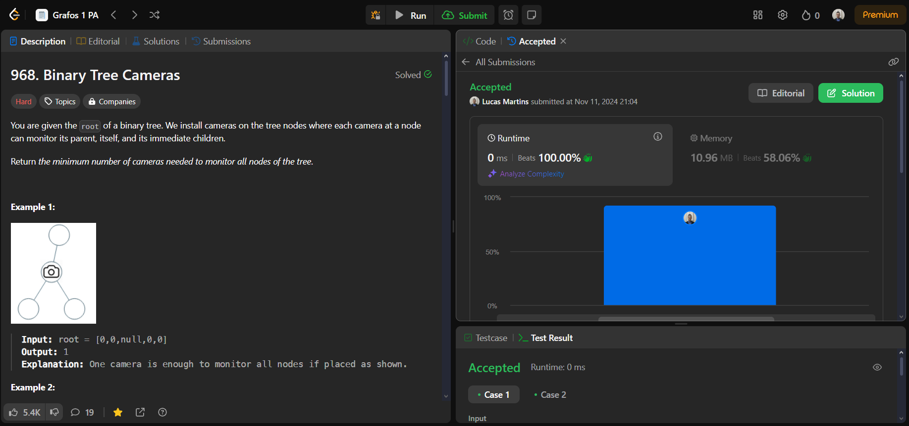
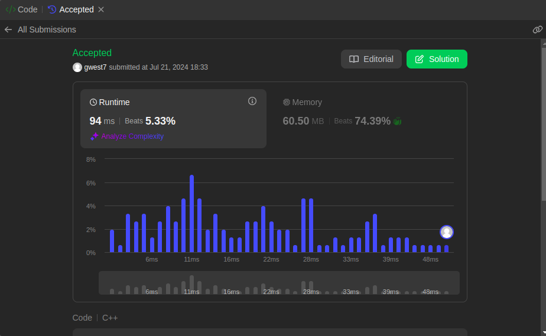
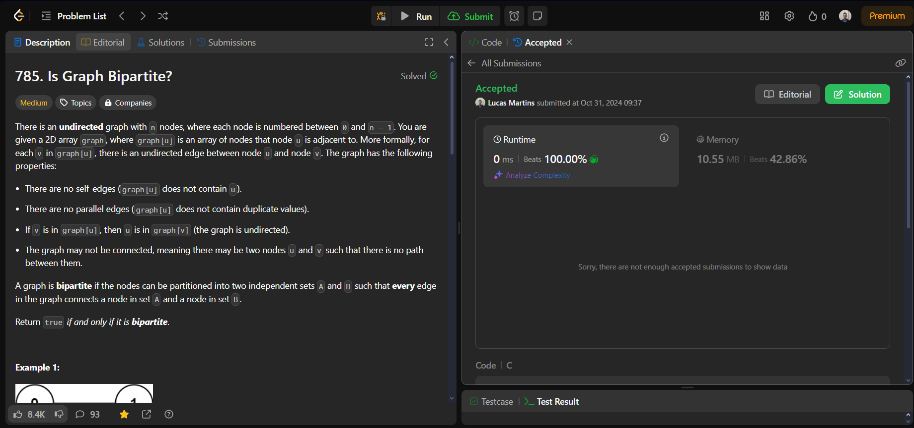
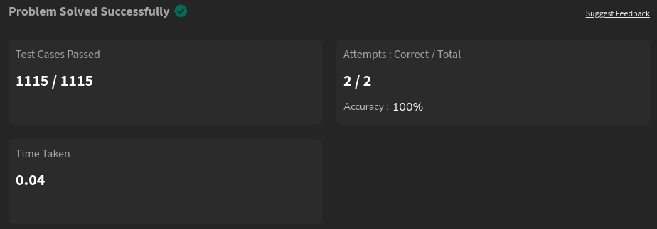
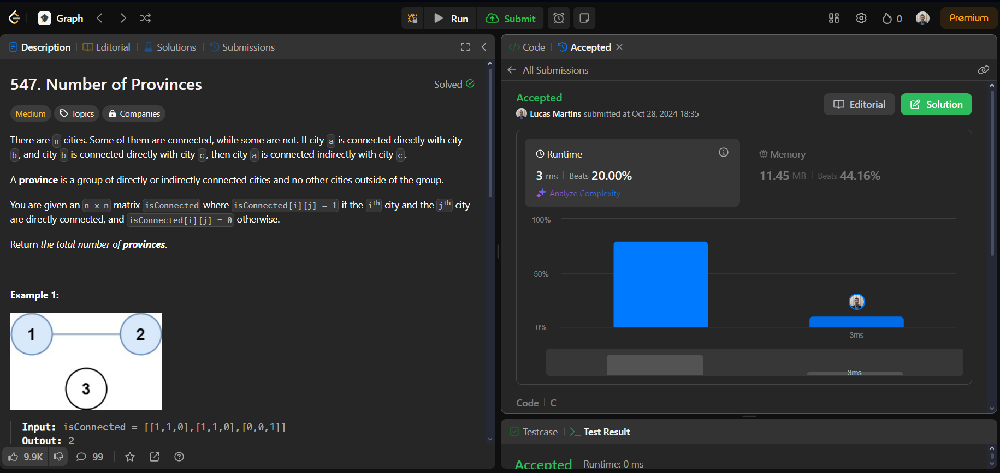

# Problems

**Número da Lista**: 19<br>
**Conteúdo da Disciplina**: Grafos 1<br>

## Alunos
|Matrícula | Aluno |
| -- | -- |
| 21/1061805  |  Guilherme Westphall de Queiroz |
| 22/1022088  |  Lucas Martins Gabriel |

## Sobre 
O objetivo do projeto é solucionar exercícios de juiz virutal sobre os algoritmos trabalhados no módulo de grafos 1.
Obs: Tentamos criar gráfica e aplciar uma ordenação topológica no fluxograma de Engenharia de Software da FGA, porém devido a alguns contratempos iremos entregar apenas os exercícios feitos em plataformas virtuais. 

## Screenshots












## Instalação 

**Linguagem**: C/C++<br>

 1. Clone o repositório
``` 
  git clone https://github.com/projeto-de-algoritmos-2024/Grafos1_Problems.git
```

2. Compile e execute o programa com gcc ou g++
```
  g++ nome_do_arquivo.cpp -o nome_do_executável && 
  ./nome_do_executável
```
